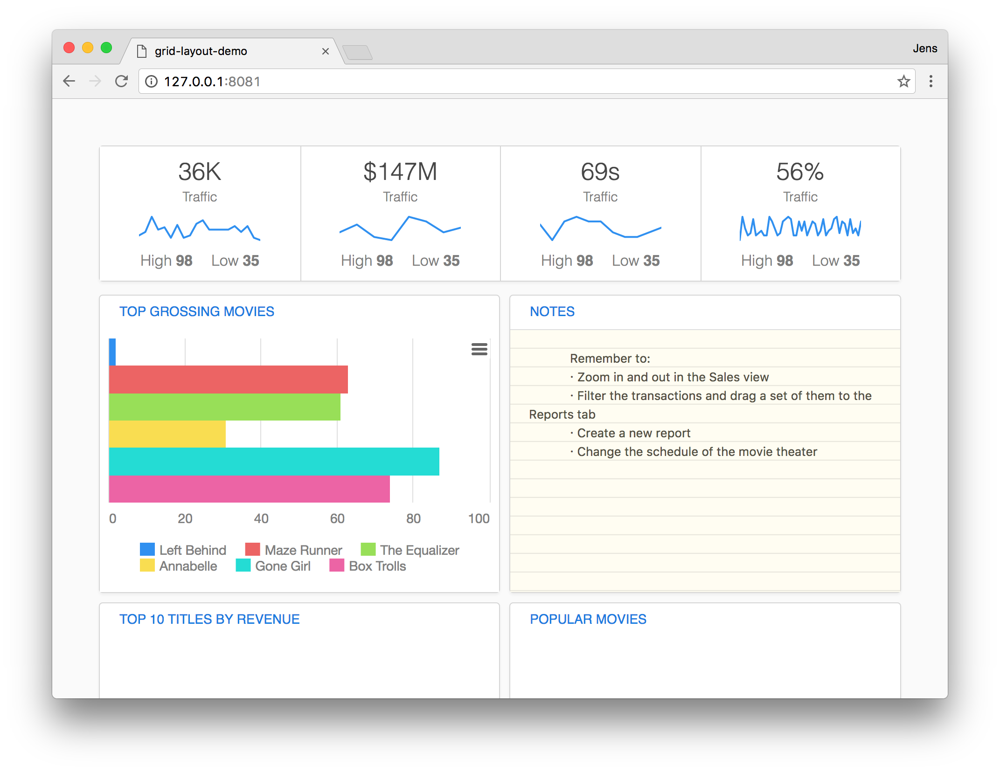

# \<dashboard-widgets\>

A set of widgets for the dashboard protos.

## install this package into your project
bower install --save Peppe/dashboard-widgets

## Import all the widgets
```
<link rel="import" href="../../bower_components/dashboard-widgets/db-widget-sparkline.html">
<link rel="import" href="../../bower_components/dashboard-widgets/db-widget-notes.html">
<link rel="import" href="../../bower_components/dashboard-widgets/db-widget-bar.html">
<link rel="import" href="../../bower_components/dashboard-widgets/db-part-frame.html">
```

# Start using them! Here are the examples.
```
<db-widget-sparkline bigvalue="36K" bigtext="Traffic" high="78" low="23" sparkline="20,23,36,25,27,18,29,18,20,30,33,25,25,25,25,28,23,28,18,16"></db-widget-sparkline>
<db-widget-sparkline bigvalue="$147M" bigtext="Revenue / day" high="147" low="95" sparkline="15,20,12,10,25,22,15,18"></db-widget-sparkline>
<db-widget-sparkline bigvalue="69s" bigtext="Checkout Time" high="106" low="35" sparkline="20,10,22,25,22,22,15,12,12,15,18"></db-widget-sparkline>
<db-widget-sparkline bigvalue="56%" bigtext="Theater Fill Rate" high="99" low="34" sparkline="10,20,15,12,13,19,12,13,14,12,12,20,18,15,12,13,18,19,20,19,12,12,18,14,18,12,15,18,17,12,14,19,12,14,15,19,20,13,18,17,12,19,13,15,12,18"></db-widget-sparkline>

<db-widget-bar></db-widget-bar>
<db-widget-notes></db-widget-notes>

<db-part-frame header="Top 10 titles by revenue"></db-part-frame>
```


# Usage
You can get a ready project with the use of this at [https://github.com/Peppe/grid-layout-demo](https://github.com/Peppe/grid-layout-demo)
